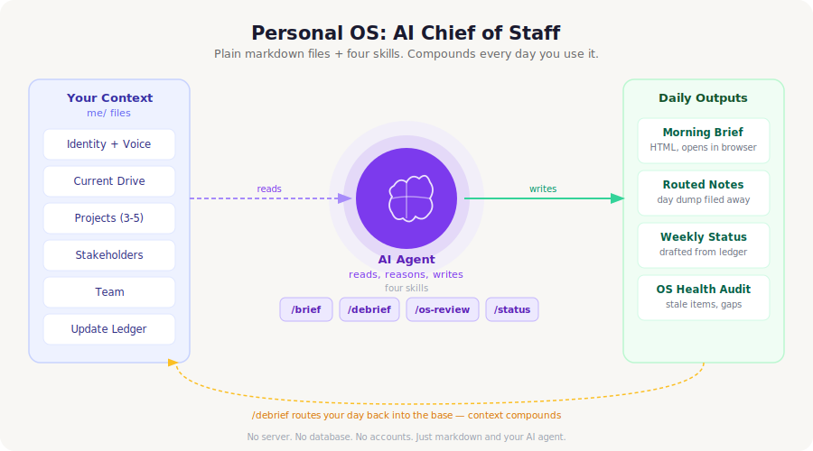

# Personal OS — AI Chief of Staff

> Most of the context that makes you effective lives in your head or scattered across tools.
> A Personal OS pulls it into one inspectable place, then **compounds** it every day you use it.

A file-based chief-of-staff system you run inside your AI coding agent (Claude Code or similar).
Plain markdown. No server, no database, no accounts.

---

## How It Works

You maintain a set of markdown files describing your role, your current drive, your projects,
stakeholders, and team. Four skills read and write that base:

| Every morning | Every evening | Every week |
|---|---|---|
| Run `/brief` — your agent reads the full base and writes a dated HTML brief: what you are driving, today's focus, where you are the blocker, who you are waiting on, and each project's state. Opens in the browser. | Run `/debrief` — paste a free-form dump of your day. The agent routes each line into the right project, stakeholder, and team files, extracts waiting-on items, and appends update nuggets to a ledger. Shows a plan and waits for your approval before writing anything. | Run `/os-review` for a read-only health audit (stale advice, dormant relationships, unfilled placeholders). Run `/weekly-status` to draft a status from the ledger and this week's goals. |

The key insight is the **compounding loop**: each debrief enriches the base, so tomorrow's brief is
more accurate than today's. Within a few weeks the system knows your projects, people, and patterns
well enough to surface things you would otherwise forget.

---

## Getting Started

**Step 1 — Get the files.**

Clone or download this repo, then open the folder in your AI agent:

```bash
git clone https://github.com/dx-dzbor/chief-of-staff.git
cd chief-of-staff
```

**Step 2 — Run the onboarding interview.**

Tell your agent:

> Read `INIT.md` and set me up.

The agent will interview you across six areas (identity, voice, direction, projects, stakeholders,
team), draft each file for your approval, and populate your `me/` base. Takes about 15-20 minutes.
You can stop or skip any section.

**Step 3 — Use it daily.**

- Morning: `/brief`
- Evening: `/debrief` followed by a paste of your day
- Weekly: `/os-review` and `/weekly-status`

Prefer to fill things in by hand? Open the `me/` files directly. Each folder has a `_TEMPLATE.md`
showing the exact fields and headings, and an `EXAMPLE-*.md` with a filled fictional version so the
schema is legible at a glance. Delete the examples once you have your own.

---

## What the Manual Covers

`MANUAL.md` is the complete guide. Here is what is in it and why you would read each section:

| Section | What it covers | Read it when |
|---|---|---|
| The six layers | Identity, direction, projects, people, capture, signals — the mental model behind the folder structure | You want to understand *why* the files are organized the way they are |
| The daily and weekly loop | Exactly what happens during `/brief` and `/debrief`, the read-pass vs. write-pass asymmetry | You are starting out or want to build the habit |
| File schemas | The frontmatter fields and headings for projects, stakeholders, and team files | You are adding a new file by hand |
| Conventions and invariants | Dated entries, append-oldest-first, no em-dashes in drafted output, drafts-not-sends | You are editing a skill or writing a new one |
| Using each skill | What `/brief`, `/debrief`, `/os-review`, and `/weekly-status` each do in detail | You want to tune or extend a skill |
| Extending the system | How to wire up connectors (Slack, Gmail, Calendar), swap in a script-based HTML renderer, or add custom skills | You want to go beyond the defaults |

---

## What Is in This Repo

```text
CLAUDE.md      bootloader: how your AI agent should read and navigate this workspace
CONTEXT.md     the architecture and data contract (layers, file schemas, update engine)
MANUAL.md      the complete guide (loop, conventions, skill details, how to extend)
INIT.md        the AI-led onboarding interview
me/            your knowledge base (identity, direction, projects, people, capture)
  projects/    one file per active project, aliases drive /debrief routing
  stakeholders/  top/ and other/ for primary vs. secondary contacts
  team/        one file per direct report or close collaborator
  updates/     raw/ holds the daily nugget ledger; config.md sets status recipients
  debriefs/    raw dump files, one per day, saved verbatim
.claude/       the four skills and their command wrappers
docs/          architecture diagram and any reference material
```

---

## The Four Skills

| Command | What it produces |
|---|---|
| `/brief` | Dated HTML file in `briefs/YYYY-MM-DD.html`. Sections: current drive banner, today's focus, acceleration check, calendar shape, where you are the blocker, who you are waiting on, project state, top stakeholder asks, broader context, and a Monday expectations check. Opens in the browser. |
| `/debrief` | Routes a free-text day dump into the right project, stakeholder, and team files. Extracts advice entries, waiting-on items, and update ledger nuggets. Shows a full routing plan and waits for your approval before writing anything. |
| `/os-review` | Read-only audit: stale advice entries, inactive projects, dormant stakeholder relationships, mismatched frontmatter, and placeholder text still unfilled. Never writes. |
| `/weekly-status` | Draft weekly status grouped by shipped / in progress / risks and asks / narrative / against-the-plan. Reads from the ledger and this week's goals. |

The skills carry full logic but run with **zero dependencies**: the agent authors the HTML brief itself,
and every connector (Slack, Gmail, Calendar, meeting notes) is optional and skipped gracefully when not
configured. Wire up connectors or drop in a script-based renderer whenever you like.

---

## Conventions Worth Knowing

- Everything is dated and attributed.
- Skills draft and propose. They never auto-send anything.
- Audits are read-only.
- No em-dashes in any drafted output.
- The raw debrief dump is always saved verbatim — nothing is lost.

---

## License

MIT. See `LICENSE`.
