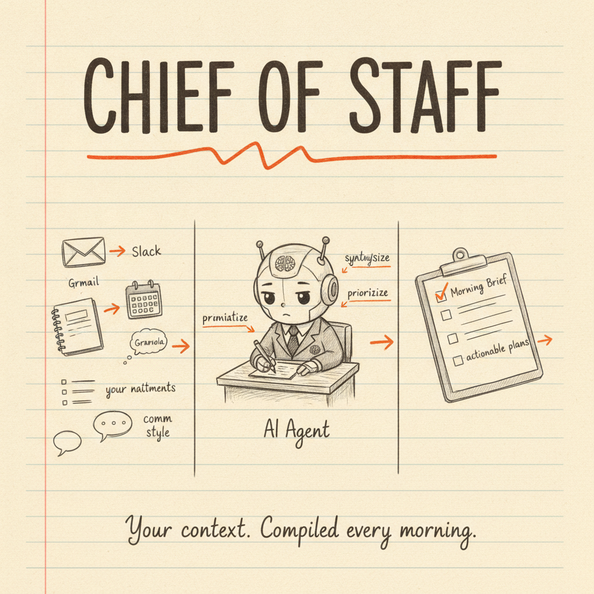
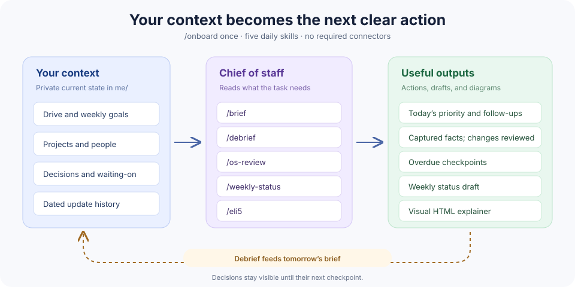

# Personal OS: AI Chief of Staff

A file-based chief of staff for people managing projects, decisions, and relationships. Your context lives in plain markdown. Five small skills turn it into a daily brief, captured notes, decision follow-through, a weekly status draft, and visual explanations. No server, database, account, or connector is required.



## The loop

| When | Command | Result |
| --- | --- | --- |
| Morning | `/brief` | An HTML brief led by today's priority, decisions needed, and follow-ups. |
| Evening | `/debrief` | Your raw dump saved verbatim; clear routine facts filed; material or uncertain changes shown for review. |
| Weekly | `/os-review` | A read-only check for overdue decisions, stale commitments, and gaps in the base. |
| Weekly | `/weekly-status` | A concise draft based on update events, goals, and current decisions. |
| Anytime | `/eli5 <topic>` | A self-contained HTML explanation with a real diagram, plain words, and source boundaries. |

The loop compounds: capture an event once, then use it in the next brief and status. `me/decisions.md` keeps the current decision picture; the dated update ledger keeps the history.

## Get started

```bash
git clone https://github.com/dx-dzbor/chief-of-staff.git
cd chief-of-staff
```

Open the folder in Claude Code or another agent that can read markdown skills. Say **"Read `INIT.md` and set me up."** The agent will help fill your role, voice, direction, projects, stakeholders, and team. It can start with one project and grow from there. Claude Code exposes the five commands in `.claude/commands/`; other agents can read the corresponding `.claude/skills/*/SKILL.md` files.

Then run `/brief` in the morning and `/debrief` after work. Run `/os-review` and `/weekly-status` each week. Try `/eli5 explain how a decision moves through this system` to see the visual format.

Open the [fictional ELI5 example](docs/eli5-example.html) locally to see the intended HTML page and diagram.

## What is in the repo

```text
CLAUDE.md          short operating contract and context loading rules
CONTEXT.md         file formats and write boundaries
MANUAL.md          daily loop and customization guide
INIT.md            guided onboarding
me/                your private working context, decisions, and update ledger
.claude/skills/     brief, debrief, os-review, weekly-status, eli5
.claude/commands/   Claude Code command wrappers
docs/              diagram and fictional examples
```

Every `me/projects/`, `me/stakeholders/`, and `me/team/` folder includes a `_TEMPLATE.md` and a fictional `EXAMPLE-*.md`. [The decision example](docs/decision-example.md) shows the active and closed record format. Replace the examples with your own context during onboarding.

## How it stays useful

- The default voice is plain, crisp, and actionable. Add your real writing samples to `me/communications.md` so drafts sound like you.
- Briefs show only real signal. Missing connectors do not block them and are not mistaken for an empty inbox.
- Debrief writes straightforward notes directly. It asks before changing decisions, obligations, entities, or uncertain facts.
- Skills draft and propose; they never send a message. `/os-review` never writes.
- Generated `briefs/` and `explainers/` HTML is ignored by Git because it may contain private context.

Read [the manual](MANUAL.md) to tune the skills or add optional Slack, email, calendar, and meeting-note connections. The core works from local markdown alone.

## License

MIT. See [LICENSE](LICENSE).
